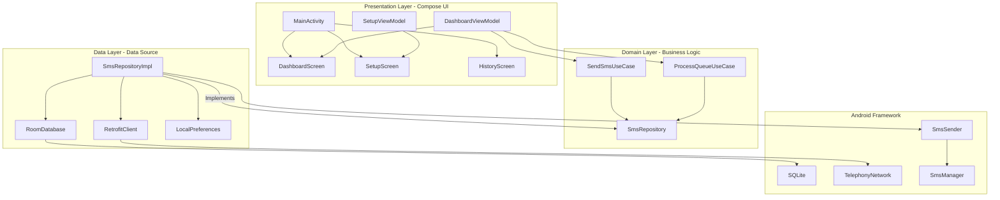
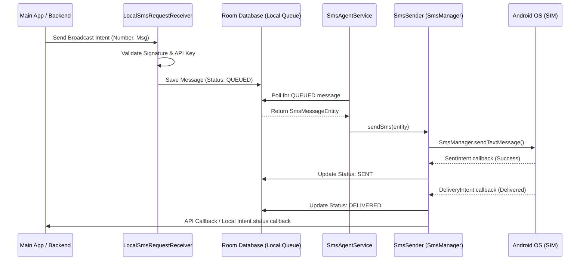
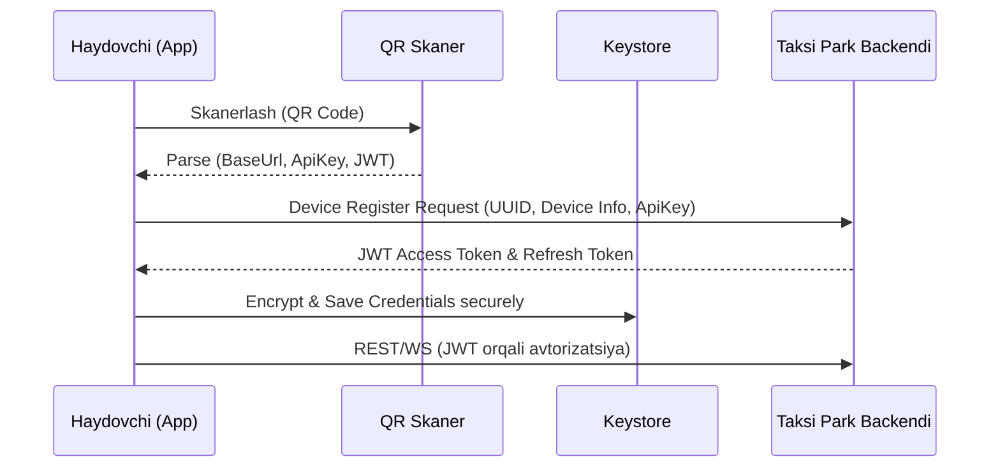
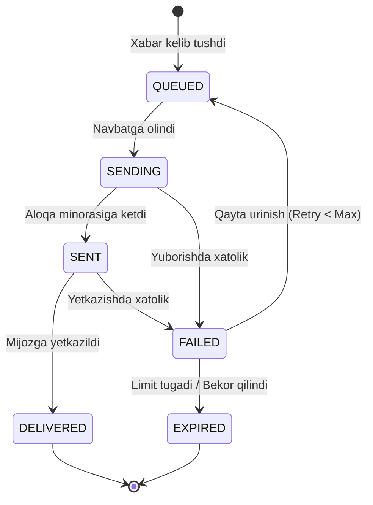

# Universal SMS Agent Platform - Texnik Vazifa (TZ)

Tizim: **Universal SMS Agent Companion App**  
Loyiha paketi: `com.taxisms.agent`  
Platform: **Android 7.0+ (API 24+)**  
Versiya: **1.0.0**  
Hujjat holati: **Tasdiqlangan**  

---

## 1. Loyiha Maqsadi va Umumiy Ko'rinish

### 1.1 Muammoning Tavsifi
Taksi xizmatlarida (masalan, UZUM Taxi, MyTaxi, Yandex Taxi yoki kichik xususiy taksi parklarida) mijozlarga SMS xabarnomalar yuborish (mijozning kelishi, buyurtma tafsilotlari, to'lov ma'lumotlari) juda muhim. Biroq:
*   Markaziy SMS provayderlar (SMS Gateway-lar) orqali xabarlar yuborish juda qimmat (har bir SMS uchun yuqori tariflar).
*   Ko'plab kichik taksi parklarining shaxsiy SMS gateway-lar bilan integratsiyalashishga budjeti yoki texnik resurslari yetarli emas.
*   Haydovchilar mijozlar bilan muloqot qilganda SMS-larni qo'lda yozishga majbur bo'ladi, bu esa vaqt yo'qotilishi va xatolarga olib keladi.

### 1.2 Taklif Qilinayotgan Yechim
**Universal SMS Agent Platform** - bu Android operatsion tizimida ishlovchi, fonda doimiy faol bo'ladigan yordamchi (companion) ilovadir. Tizim haydovchining o'z mobil telefoni va undagi faol SIM-kartalar yordamida SMS-larni mutlaqo avtomatik ravishda yuborishni ta'minlaydi. Ilova mustaqil ishlaydi, markaziy backend talab qilmaydi va to'g'ridan-to'g'ri taksi parkining mavjud backend tizimi yoki telefondagi asosiy haydovchi ilovasi (Main Driver App) bilan integratsiyalashadi.

### 1.3 Loyiha Maqsadlari
*   **Arzon SMS Yuborish**: Haydovchining tarif rejasidagi bepul yoki arzon SMS-lardan foydalanish.
*   **Universal Integratsiya**: Istalgan taksi park backendiga REST, WebSocket yoki QR orqali tezda ulanish yoki telefondagi asosiy ilovadan lokal Intent-lar yordamida buyruqlar qabul qilish.
*   **Fonda Barqaror Ishlash**: Android OS fon cheklovlarini aylanib o'tib, ilova o'chib qolmasligini ta'minlash (Foreground Service).
*   **Dual SIM va Avtomatlashtirish**: Ikki SIM-kartadan oqilona foydalanish, limitlarni nazorat qilish va offlayn navbat tizimi.

---

## 2. Biznes Logikasi (Business Logic)

### 2.1 Foydalanish Holatlari (Use Cases)

```mermaid
usecaseDiagram
    actor Haydovchi as Driver
    actor Asosiy_Ilova as Main App
    actor Park_Backendi as Park Backend
    
    Driver --> (QR Code orqali ulanish)
    Driver --> (Sozlamalarni qo'lda kiritish)
    Driver --> (SMS tarixini ko'rish)
    Driver --> (SIM va Limitlarni sozlash)
    
    Asosiy_Ilova --> (Lokal Intent orqali SMS yuborish)
    Park_Backendi --> (REST/WebSocket orqali SMS topshiriqlarini yuborish)
    Park_Backendi --> (SMS Holatini yangilash)
```

#### UC-1: Qurilmani Ro'yxatdan O'tkazish (QR Code)
*   **Tavsif**: Haydovchi taksi parki taqdim etgan QR kodni skanerlash orqali SMS Agent-ni o'sha park backendiga ulaydi.
*   **Asosiy oqim**:
    1. Haydovchi ilovani ochadi va "QR orqali ulanish" tugmasini bosadi.
    2. Kamera ruxsatnomasi so'raladi va QR skaner ochiladi.
    3. QR kod tarkibidagi URL, API Key va JWT token o'qiladi.
    4. Ilova ushbu ma'lumotlar bilan backendga ro'yxatdan o'tish (Register Device) so'rovini yuboradi.
    5. Muvaffaqiyatli javob olingach, ma'lumotlar mahalliy Room DB-da saqlanadi va ulanish faollashadi.

#### UC-2: Avtomatik SMS Yuborish (Masofaviy)
*   **Tavsif**: Taksi parki backendi yangi buyurtma yaratilganda SMS Agent-ga WebSocket yoki REST API orqali topshiriq yuboradi.
*   **Asosiy oqim**:
    1. Fondagi `SmsAgentService` doimiy ochiq WebSocket yoki REST polling orqali topshiriqlarni kutadi.
    2. Topshiriq kelganda, u Room DB `sms_messages` jadvaliga `QUEUED` holatida yoziladi.
    3. Navbat protsessori (Queue Processor) yangi xabarni oladi va uning ustuvorligini (Priority) tekshiradi.
    4. `SmsManager` yordamida haydovchi tanlagan SIM slotidan xabar mijozga yuboriladi.
    5. Yuborish natijasi (Sent) va yetkazilish natijasi (Delivered) olinib, backendga hisobot yuboriladi.

#### UC-3: Lokal Intent orqali Integratsiya
*   **Tavsif**: Telefonda o'rnatilgan asosiy taksi ilovasi (Main App) Android Intent-lari orqali SMS Agent-ga SMS yuborish buyrug'ini uzatadi.
*   **Asosiy oqim**:
    1. Asosiy ilova `com.taxisms.agent.SEND_SMS` action-i bilan Intent jo'natadi.
    2. SMS Agent tarkibidagi `LocalSmsRequestReceiver` ushbu Intent-ni qabul qiladi.
    3. Jo'natuvchi ilovaning paketi va imzosi (Signature) tekshiriladi (Xavfsizlik uchun).
    4. Ruxsat berilgan bo'lsa, xabar navbatga olinadi va avtomatik ravishda yuboriladi.

### 2.2 Biznes Qoidalari (Business Rules)
*   **BR-1 (SMS Limitlar)**: Tizim haydovchining SIM-kartasi operator tomonidan bloklanib qolmasligi uchun limitlarni tekshiradi. Masalan: minutiga maksimal 5 ta, soatiga 50 ta va kuniga 250 ta SMS. Limit oshganda xabarlar navbatda ushlab turiladi.
*   **BR-2 (Anti-Spam)**: Bitta mijoz raqamiga 3 daqiqa ichida faqat 1 ta xabar yuborishga ruxsat beriladi. Qolgan takroriy xabarlar bekor qilinadi.
*   **BR-3 (Dual SIM qoidasi)**: Agar SIM-1 balansida muammo bo'lsa yoki limit tugasa, tizim avtomatik ravishda SIM-2 ga o'tishi (Fallback) kerak.
*   **BR-4 (Offline Rejim)**: Internet aloqasi uzilganda SMS topshiriqlari mahalliy bazada to'planadi va internet tiklanganda sinxronizatsiya qilinadi.

---

## 3. Tizim Arxitekturasi (System Architecture)

Ilova **Clean Architecture** va **MVVM (Model-View-ViewModel)** dizayn andozalari asosida ishlab chiqilgan. Bu kodning sinovchanligini (testability), kengayuvchanligini va modulliligini ta'minlaydi.

### 3.1 Umumiy Arxitektura Diagrammasi



### 3.2 Ma'lumotlar Oqimi (Data Flow)



---

## 4. Android SMS Agent Batafsil Sozlamalari

### 4.1 Fondagi Xizmatlar va Barqarorlik
*   **Foreground Service (`SmsAgentService`)**: Android tizimi fondagi ilovalarni batareya tejash maqsadida tozalab tashlaydi. Buning oldini olish uchun ilovada doimiy ishlovchi Foreground Service ishga tushiriladi va status bar-da doimiy xabarnoma (Persistent Notification) ko'rsatiladi.
*   **Battery Optimization Bypass**: Ilova sozlash jarayonida haydovchidan `REQUEST_IGNORE_BATTERY_OPTIMIZATIONS` ruxsatnomasini olishni so'raydi, bu ilovaning Doze Mode rejimida ham cheklovlarsiz ishlashiga imkon beradi.
*   **Boot Completed Receiver (`BootReceiver`)**: Telefon o'chib yonganda yoki qayta yuklanganda SMS Agent avtomatik ravishda fonda o'z ishini davom ettiradi (`RECEIVE_BOOT_COMPLETED` ruxsati orqali).

### 4.2 SMS Jo'natish Mexanizmi (SmsManager)
*   **Multipart SMS**: Agar xabar 160 ta belgidan (yoki kirill yozuvida 70 ta belgidan) oshsa, u avtomatik ravishda `divideMessage()` yordamida qismlarga bo'linadi va `sendMultipartTextMessage()` orqali yuboriladi.
*   **Sent & Delivery Callbacks**: Har bir SMS yuborilganda Android OS-dan ikkita callback kutiladi:
    1.  `SENT_SMS_ACTION` - SMS aloqa minorasiga muvaffaqiyatli yetib borganligini tasdiqlaydi.
    2.  `DELIVERED_SMS_ACTION` - SMS mijoz telefoniga qabul qilinganligini (Operator tasdiqlagan hisobot) tasdiqlaydi.

---

## 5. iOS Cheklovlari va Muqobil Yechimlar

> [!WARNING]
> **iOS Operatsion Tizimi Cheklovlari**: Apple xavfsizlik va maxfiylik siyosatiga ko'ra, iOS ilovalariga fon rejimida foydalanuvchi aralashuvisiz (background automated SMS sending) SMS yuborishga qat'iyan ruxsat bermaydi. Shuningdek, iOS-da `SmsManager` kabi past darajadagi API mavjud emas.

### 5.1 Muqobil Yechimlar (iOS uchun)
1.  **Android Companion Platforma (Tavsiya etiladi)**: Haydovchi o'zining shaxsiy iOS telefonidan foydalansa ham, mashinasida arzon ikkinchi darajali Android telefon (SMS Agent o'rnatilgan) saqlaydi. iOS dagi asosiy taksi ilovasi backend orqali SMS topshirig'ini ushbu Android telefonga yuboradi.
2.  **Server-side SMS Gateway**: iOS platformasidagi haydovchilar uchun SMS yuborish bevosita taksi parkining markaziy serveri orqali (Twilio, PlayMobile va h.k.) amalga oshiriladi (bu qimmatroq, lekin yagona yechim).
3.  **Lokal Trigger (Manual confirmation)**: iOS-da `MFMessageComposeViewController` yordamida SMS yozish oynasini oldindan to'ldirilgan matn bilan ochish, lekin yuborish tugmasini haydovchining o'zi qo'lda bosishi shart.

---

## 6. Universal Integratsiya Tizimi (Integration API)

SMS Agent istalgan taksi park backend tizimi bilan ikkita asosiy usulda integratsiyalasha oladi.

### 6.1 Lokal Integratsiya (Intent-based)
Ushbu usulda taksi parkining haydovchi telefonda o'rnatilgan asosiy ilovasi (masalan, Flutter, React Native, Java/Kotlin) SMS Agent bilan Android IPC (Inter-Process Communication) orqali muloqot qiladi.

#### Intent formatlari:
*   **Action**: `com.taxisms.agent.SEND_SMS`
*   **Category**: `android.intent.category.DEFAULT`
*   **Permission**: `com.taxisms.agent.permission.SEND_SECURE_SMS` (Faqat ruxsat berilgan ilovalar uchun)

#### Request Extras:
```json
{
  "phone_number": "+998901234567",
  "message": "Assalomu alaykum! Siz kutayotgan taksi yetib keldi. Raqami: 01 A 777 AA",
  "park_id": "park_uzum_01",
  "priority": "HIGH"
}
```

#### Natija Callback:
SMS Agent jo'natilgan xabar natijasini `com.taxisms.agent.SMS_STATUS_CHANGED` action-i orqali qayta eshittiradi (Broadcast).
```json
{
  "sms_id": 1245,
  "phone_number": "+998901234567",
  "status": "DELIVERED",
  "error_code": 0
}
```

### 6.2 Masofaviy Integratsiya (Remote API)
Agar taksi parkining telefondagi ilovasi emas, balki backend tizimi bevosita SMS Agent bilan bog'lanmoqchi bo'lsa, quyidagi REST va WebSocket protokollaridan foydalaniladi.

#### A) REST API: Pending SMS-larni so'rash (Polling)
Ilova har `pollingIntervalMs` (default 5 soniya) vaqtda backenddan yuborilishi kerak bo'lgan xabarlar ro'yxatini so'raydi.

*   **Request**: `GET {baseUrl}/api/v1/sms/pending`
*   **Headers**:
    *   `Authorization: Bearer <JWT>`
    *   `X-API-Key: <API_KEY>`
    *   `X-Device-UUID: <DEVICE_UUID>`

*   **Response (200 OK)**:
```json
{
  "status": "success",
  "data": [
    {
      "external_id": "msg_9981241",
      "phone_number": "+998935552211",
      "message": "Sizning buyurtmangiz qabul qilindi. Spark, Oq, 01|123AAA",
      "priority": "URGENT",
      "sim_slot": 0
    }
  ]
}
```

#### B) REST API: Status hisoboti (Webhook/Callback)
SMS Agent xabar yuborilganidan yoki yetkazilganidan so'ng backendga hisobot yuklaydi.

*   **Request**: `POST {baseUrl}/api/v1/sms/status`
*   **Body**:
```json
{
  "external_id": "msg_9981241",
  "status": "DELIVERED",
  "sent_at": 1719546120000,
  "delivered_at": 1719546135000,
  "sim_used": 1,
  "error_code": null,
  "error_message": null
}
```

#### C) WebSocket Protokoli (Real-time)
Doimiy va tezkor SMS yuborish uchun WebSocket kanali o'rnatiladi. WebSocket orqali keladigan buyruq formati:

```json
{
  "event": "send_sms",
  "data": {
    "external_id": "ws_991823",
    "phone_number": "+998909998877",
    "message": "Taksi 3 daqiqada yetib boradi.",
    "priority": "HIGH"
  }
}
```

---

## 7. Autentifikatsiya va Avtorizatsiya

SMS Agent va taksi park backendi o'rtasidagi aloqa to'liq xavfsiz bo'lishi kerak.



### 7.1 Device Registration
Har bir qurilma birinchi marta ulanganda o'zining unikal identifikatori (UUID - `Settings.Secure.ANDROID_ID` va Hardware Serial orqali hosil qilingan xesh) bilan ro'yxatdan o'tadi.

### 7.2 QR Code formati
QR kod tarkibida quyidagi JSON tuzilmasi Base64 shifrlangan formatda bo'ladi:
```json
{
  "n": "Uzum Taxi Park 12",
  "u": "https://api.uzumtaxi.uz/sms-agent",
  "k": "sec_key_998a123f8bc991",
  "m": "WEBSOCKET"
}
```

---

## 8. SMS Navbat Tizimi (Local SMS Queue)

Mahalliy navbat Android Room Database yordamida boshqariladi.



### 8.1 Ustuvorlik Tizimi (Priority Queue)
Xabarlar yuborilishidan oldin ularning ustuvorligi tekshiriladi:
1.  **URGENT (Juda muhim)**: Haydovchi mijoz eshigi oldiga kelgani haqidagi SMS (Tezkor yetib borishi shart).
2.  **NORMAL (Standart)**: Buyurtma qabul qilingani yoki narxi haqidagi SMS.
3.  **LOW (Past)**: Kundalik reklama yoki haydovchining ish vaqti tugaganidan keyingi hisobotlar.

---

## 9. Error Code Tizimi

Ilovada bappar yuz berishi mumkin bo'lgan xatoliklar unikal kodlar bilan belgilanadi:

| Xatolik kodi | Kategoriya | Xatolik nomi | Tavsif | Taktika / Yechim |
|---|---|---|---|---|
| **1000** | Tarmoq | `NO_INTERNET` | Internet ulanishi mavjud emas. | Local Queue-ga saqlash va sinxronizatsiyani kutish. |
| **1001** | Tarmoq | `TIMEOUT` | Server javob bermadi. | Exponential Backoff orqali qayta urinish. |
| **2000** | SMS | `GENERIC_FAILURE` | Android SMS yuborishda noma'lum xato. | SIM holatini tekshirish, qayta urinish. |
| **2001** | SMS | `NO_SERVICE` | Mobil tarmoq mavjud emas (Antenna yo'q). | Tarmoq paydo bo'lguncha kutish (Retry Keyinroq). |
| **2002** | SMS | `RADIO_OFF` | Samolyot rejimi yoki radio aloqa o'chirilgan. | Foydalanuvchiga bildirishnoma ko'rsatish. |
| **2003** | SMS | `LIMIT_EXCEEDED` | Tizim kunlik/soatlik SMS limitidan oshib ketdi. | Xabarlarni navbatda ushlab turish. |
| **3000** | Autentifikatsiya | `UNAUTHORIZED` | API Key yoki JWT eskirgan/noto'g'ri. | Refresh Token orqali yangilash yoki qayta QR so'rash. |
| **4000** | Xavfsizlik | `DEVICE_NOT_TRUSTED` | Qurilma Root qilingan yoki Play Integrity tekshiruvidan o'tmadi. | SMS jo'natishni to'xtatish va ogohlantirish. |

---

## 10. White Label Tizimi

Loyiha mutlaqo moslashuvchan bo'lib, bir nechta park uchun alohida dizayn va brendingni qo'llab-quvvatlaydi.

### 10.1 Dinamik White Label
Haydovchi QR kodni skanerlaganda, backend konfiguratsiya faylida park logotipi va ranglarini qaytaradi:
*   `primary_color`: `#FF5722` (Uzum Taxi uchun to'q sariq)
*   `secondary_color`: `#000000`
*   `logo_url`: `https://cdn.uzum.uz/logo.png`

Ilova ushbu ranglar va rasmni yuklab olib, Jetpack Compose UI interfeysini dinamik ravishda o'zgartiradi (Dynamic Theme Engine).

### 10.2 Compile-time White Label (Gradle Flavors)
Agar har bir taksi parki o'zining alohida APK faylini Play Store-ga mustaqil joylamoqchi bo'lsa, Gradle `productFlavors` orqali sozlanadi:
```kotlin
productFlavors {
    create("uzum") {
        applicationIdSuffix = ".uzum"
        dimension = "brand"
    }
    create("mytaxi") {
        applicationIdSuffix = ".mytaxi"
        dimension = "brand"
    }
}
```

---

## 11. Xavfsizlik (Security & Device Integrity)

Yordamchi ilova sifatida SMS Agent haydovchining shaxsiy ma'lumotlariga va SMS tizimiga kirish ruxsatiga ega. Shuning uchun xavfsizlik eng yuqori darajada bo'lishi kerak.

### 11.1 Play Integrity API
Ilova Google Play Integrity API bilan integratsiya qilinadi. Bu:
*   Ilovaning rasmiy o'zgartirilmagan versiya ekanligini (Anti-Tampering).
*   Qurilma haqiqiy Android qurilmasi ekanligini (Anti-Emulator).
*   Qurilmada zararli dasturlar yo'qligini tasdiqlaydi.

### 11.2 Root Detection (Root aniqlash)
Quyidagi tekshiruvlar orqali tizim root qilinganligini aniqlaydi:
*   `su` binary fayllarining mavjudligi (`/system/xbin/su`, `/system/bin/su`).
*   Magisk yoki SuperSU ilovalarining o'rnatilganligi.
*   System Properties ichida `ro.debuggable` yoki `ro.secure` parametrlarini tekshirish.
*   Root aniqlangan taqdirda, ilova muhim ma'lumotlarni saqlashdan bosh tortadi va SMS jo'natish funksiyasini bloklaydi.

### 11.3 Ma'lumotlarni Shifrlash (Data Encryption)
*   **EncryptedSharedPreferences**: API Key va JWT tokenlar Android Keystore yordamida shifrlangan holda saqlanadi.
*   **SQLCipher**: Room Database fayli to'liq AES-256 shifr bilan qoplanadi, bu esa telefon yo'qolganda ham ma'lumotlar bazasini begona shaxslar o'qiy olmasligini ta'minlaydi.

---

## 12. Loyiha Papkalar Strukturasi (Android Studio Structure)

Clean Architecture talablariga mos papkalar tuzilmasi:

```text
com.taxisms.agent/
│
├── App.kt                          # Application klassi, Hilt va Timber init
│
├── data/                           # Ma'lumotlar qatlami (Room, Retrofit, Prefs)
│   ├── local/
│   │   ├── db/
│   │   │   ├── AppDatabase.kt      # Room Database configuration
│   │   │   └── Converters.kt       # TypeConverters
│   │   ├── dao/
│   │   │   ├── SmsDao.kt           # SMS xabarlar uchun DAO
│   │   │   └── ConnectionDao.kt    # Taksi park ulanishlari DAO
│   │   └── entity/
│   │       ├── SmsMessageEntity.kt
│   │       └── ConnectionEntity.kt
│   ├── remote/
│   │   ├── api/
│   │   │   ├── ApiService.kt       # Retrofit HTTP Interface
│   │   │   └── ApiModels.kt        # Request/Response modellar
│   │   └── websocket/
│   │       └── WsManager.kt        # WebSocket ulanish menejeri
│   └── repository/
│       ├── SmsRepositoryImpl.kt
│       └── ConnectionRepositoryImpl.kt
│
├── domain/                         # Biznes qoidalari (UseCases, Interfaces)
│   ├── model/
│   │   ├── SmsMessage.kt
│   │   └── ConnectionConfig.kt
│   ├── repository/
│   │   ├── SmsRepository.kt
│   │   └── ConnectionRepository.kt
│   └── usecase/
│       ├── SendSmsUseCase.kt
│       ├── ProcessQueueUseCase.kt
│       └── ValidateConnectionUseCase.kt
│
├── service/                        # Android System Services
│   ├── SmsAgentService.kt          # Foreground Service (SMS Queue Processor)
│   └── BootReceiver.kt             # Telefon yoqilganda ishga tushiruvchi receiver
│
├── sender/                         # SMS & SIM hardware controller
│   ├── SmsSender.kt                # SmsManager controller
│   └── SimManager.kt               # SubscriptionManager (Dual SIM detector)
│
├── security/                       # Xavfsizlik modullari
│   ├── RootDetector.kt
│   ├── IntegrityChecker.kt
│   └── EncryptionManager.kt
│
└── ui/                             # Jetpack Compose UI ekranlari
    ├── theme/
    │   ├── Color.kt
    │   └── Theme.kt
    ├── main/
    │   ├── MainActivity.kt
    │   └── MainViewModel.kt
    ├── dashboard/
    │   ├── DashboardScreen.kt
    │   └── DashboardViewModel.kt
    └── setup/
        ├── SetupScreen.kt
        └── SetupViewModel.kt
```

---

## 13. Integratsiya Qo'llanmalari (SDK & Code Examples)

### 13.1 Flutter Ilovasi orqali Lokal Integratsiya
Asosiy haydovchi ilovasi (Flutter-da yozilgan bo'lsa) SMS yuborish uchun quyidagi Dart kodidan foydalanadi:

```dart
import 'package:flutter/services.dart';

class SmsAgentSDK {
  static const MethodChannel _channel = MethodChannel('com.taxisms.agent/ipc');

  /// SMS Agent ilovasiga SMS yuborish buyrug'ini jo'natish
  static Future<bool> sendSms({
    required String phoneNumber,
    required String message,
    required String parkId,
    String priority = 'NORMAL',
  }) async {
    try {
      final bool result = await _channel.invokeMethod('sendSms', {
        'phone_number': phoneNumber,
        'message': message,
        'park_id': parkId,
        'priority': priority,
      });
      return result;
    } on PlatformException catch (e) {
      print("SMS jo'natishda xatolik: ${e.message}");
      return false;
    }
  }
}
```

Android qismidagi Java/Kotlin kanali orqali Intent jo'natish:
```kotlin
val intent = Intent().apply {
    action = "com.taxisms.agent.SEND_SMS"
    putExtra("phone_number", phoneNumber)
    putExtra("message", message)
    putExtra("park_id", parkId)
    putExtra("priority", priority)
    // Xavfsizlik kaliti
    putExtra("api_key", "sec_local_key_123")
}
context.sendBroadcast(intent)
```

---

## 14. Reliz va Deployment Rejasi

### 14.1 Google Play Store ga Joylash (Default SMS App masalasi)
*   **Muhim**: Google Play Store siyosatiga ko'ra, ilova fonda avtomatik SMS yubora olishi uchun u foydalanuvchi tomonidan "Default SMS App" (Tizimning asosiy SMS ilovasi) deb tanlanishi lozim bo'lishi mumkin (`SEND_SMS` ruxsatnomasi uchun Google ruxsati kerak).
*   **Muqobil yo'l (Xususiy tarqatish)**: Taksi parklari haydovchilariga APK faylini bevosita shaxsiy yuklab olish sahifalari yoki Firebase App Distribution / o'zlarining shaxsiy MDM (Mobile Device Management) tizimlari orqali tarqatadilar. Bu holda Google Play cheklovlari aylanib o'tiladi.

---
*Ushbu hujjat loyihaning poydevori hisoblanadi va keyingi bosqichlarda dastur kodining ushbu talablarga mos kelishi ta'minlanadi.*
